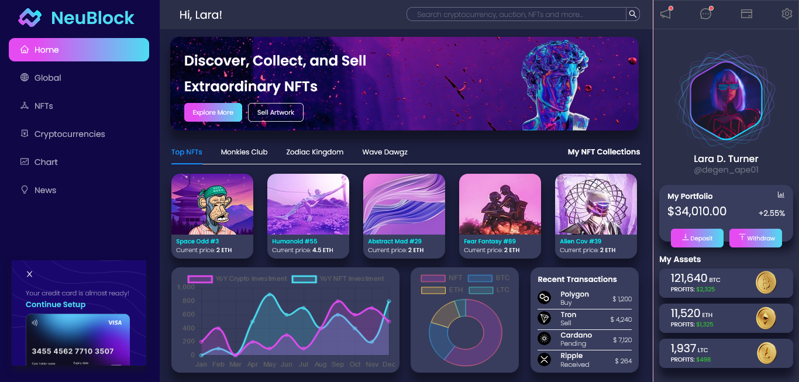

# NeuBlock Frontend App
  - Live Site URL: [https://neu-block.vercel.app](https://neu-block.vercel.app)
  
## Table of contents

- [Overview](#overview)
  - [Screenshot](#screenshot)
- [Installation Errors](#installation-errors)

### Screenshot



### Installation Errors
1. Don't forget to create an `.env` file in the root folder and register env information into Vercel and your other website hosts.
1. Upon cloning the project, whenever an error appears about middleware, just paste the code below to the `store.js` inside our app folder. `Uncaught Error: Warning: Middleware for RTK-Query API at reducerPath has not been added to the store. You must add the middleware for RTK-Query to function correctly!`
 ```shell
     # MIDDLEWARE
     middleware: (getDefaultMiddleware) =>
    getDefaultMiddleware()
    .concat(cryptoApi.middleware)
    .concat(cryptoNewsApi.middleware)
    .concat(nftApi.middleware)
    .concat(webitApi.middleware),
        
     # IT SHOULD LOOK LIKE THIS 
     import { configureStore } from '@reduxjs/toolkit';

     import { cryptoApi } from '../services/cryptoApi';
     import { cryptoNewsApi } from '../services/cryptoNewsApi';
     import { nftApi } from '../services/nftApi';
     import { webitApi } from '../services/webitApi';

     export default configureStore({
     reducer: {
          [cryptoApi.reducerPath]: cryptoApi.reducer,
          [cryptoNewsApi.reducerPath]: cryptoNewsApi.reducer,
          [nftApi.reducerPath]: nftApi.reducer,
          [webitApi.reducerPath]: webitApi.reducer,
     },
     middleware: (getDefaultMiddleware) =>
     getDefaultMiddleware()
     .concat(cryptoApi.middleware)
     .concat(cryptoNewsApi.middleware)
     .concat(nftApi.middleware)
     .concat(webitApi.middleware),
          
     });
 ```
 
## Author

- Twitter - [@julfinch](https://www.twitter.com/julfinch)
